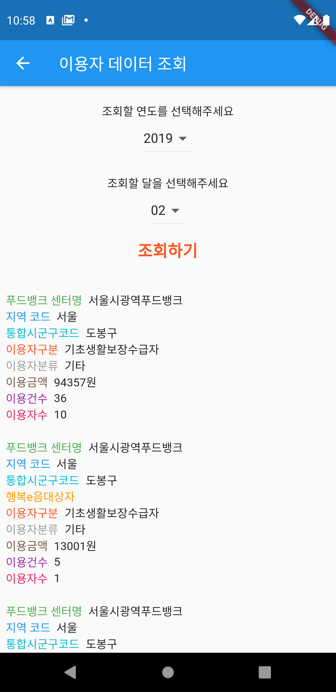
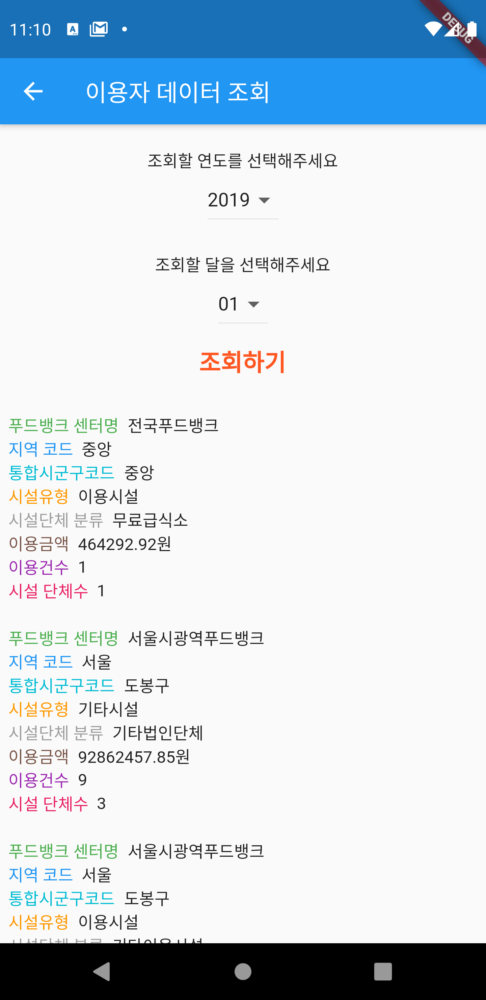

# Food Bank

# Flutter를 활용한 공공데이터 조회 - 푸드뱅크

# API key는 공공데이터 포털에 접속하여 로그인을 한 뒤 활용신청을 하면 받을 수 있습니다.
> [data.go.kr](data.go.kr)

## data.go.kr에서 제공하는 json 파일의 주소는 http로 시작하기 때문에 flutter에서 채널을 반드시 stable로 설정
```
flutter channel stable
```

# Result1


# Result2

